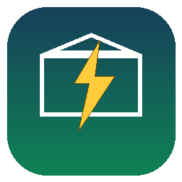

# Home Consumption Analyzer

Home Assistant (HACS) integration that computes household energy
consumption from your existing cumulative energy meters (grid import/export
per tariff, PV production per inverter, battery charge/discharge per
inverter, EV charging).

## Why

Household consumption usually isn't measured directly on a solar + battery
installation. This integration reconstructs it from the balance at the
electrical panel:

```
Consumption = ΣPV production + Grid import (T1+T2) + ΣBattery discharge
            − Grid export (T1+T2) − ΣBattery charge
```

## Configuration

Setup is a **single form**. Only 3 fields are required — Grid export
Tariff 1, Grid import Tariff 1, and PV production Inverter 1 — everything
else (Tariff 2, additional PV inverters/batteries, EV charging, Peak Hours
windows, rolling-average periods) has a sensible default or is optional.

The same single form is used again afterwards via **Configure**.

### Fields

| Field | Required |
|---|---|
| Grid export - Tariff 1 | ✅ |
| Grid export - Tariff 2 | – |
| Grid import - Tariff 1 | ✅ |
| Grid import - Tariff 2 | – |
| PV production - Inverter 1 | ✅ |
| PV production - Inverter 2 | – |
| PV production - Inverter 3 | – |
| Battery charge 1/2/3 (Inverter 1/2/3) | – |
| Battery discharge 1/2/3 (Inverter 1/2/3) | – |
| EV charging | – *(reserved for a future phase)* |
| Peak Hours - Window 1/2 - Start/End | defaults to 07:00–22:00 and 00:00–00:00 |
| Rolling average - short/long period (days) | defaults to 15 and 30 |

## Sensors created

- **Total Household Consumption**, **Daily Household Consumption** (kWh,
  `total_increasing` / `total`)
- **Peak Window 1 / 2 Consumption**, **Peak Window 1 / 2 Daily Consumption**
  (kWh)
- **Peak Window 1 / 2 Average Consumption (Nd)** — 2 per window,
  configurable day counts, history persisted in Home Assistant's storage
  (`.storage/`) and survives restarts

All entity IDs use a short `hca_` prefix (e.g. `sensor.hca_total`,
`sensor.hca_peak1_daily`, `sensor.hca_peak1_avg_15d`).

## Installation

1. HACS → Integrations → ⋮ menu → *Custom repositories* → add
   `https://github.com/benji-beit/ha-home-consumption-analyzer` (category
   *Integration*).
2. Install *Home Consumption Analyzer*, restart Home Assistant.
3. Settings → Devices & services → Add integration → *Home Consumption
   Analyzer*.
4. Fill in the form (only the 3 fields marked required are mandatory).

## Known limitations

- The kWh energy-balance sensors accumulate deltas from source sensors as
  events arrive; small transient discrepancies from asynchronous
  inverter/meter updates are absorbed by Home Assistant's standard
  `total_increasing` behavior (a momentary decrease is treated as a reset).
- The "EV charging" energy sensor is configurable but not yet used in the
  kWh balance calculation (planned for a future phase).

## Changelog

### 0.1.0
- Initial release: cumulative energy balance (kWh) only.
